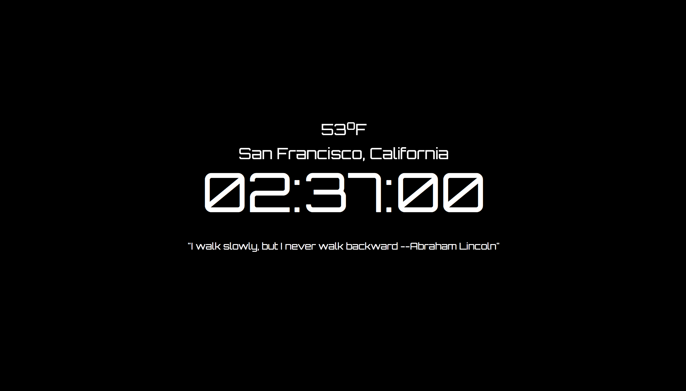

# Digital Clock sideProject

This is a basic Digital Clock written in HTML, CSS and JavaScript (with jQuery). On the main page, the application shows your location (i.e. the name of the city you are at), current temperature , and one random but inspiring quote.

## Table of Contents

* [Instructions](#instructions)
* [Project contents](#project-contents)
* [Bugs](#Bugs)
* [Contributing](#contributing)

## Instructions

To open the application, simply download the repository and open `index.html` by any Internet browser..

## Project contents

The project is structured as followed:

* main folder contains the actual index.html page with the game, README and other files.
* `style.css`  contains the styling of the page
* `app.js`  contains the javascript file describing the mechanics of the application
* `randomQuotes.js`  contains the javascript file describing the mechanics of the random quotes generated

## Bugs

The game is still under-development as the city name does not display if we deploy the application on codepen.io

## Contributing

This repository is my sideProject during my learning journey of Udacity's Front End Web development Nanodegree. Any additional code review or idea in improving the application will be much appreciated.

